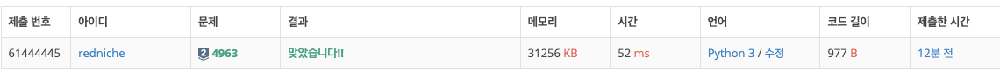

## 문제 링크

[4963번: 섬의 개수](https://www.acmicpc.net/problem/4963)

## 문제 풀이

- 이 문제는 BFS 8방 탐색으로 풀 수 있습니다.
- 8방 탐색이란 2차원 리스트에서 가로 좌표 세로 좌표를 동서남북 + 추가 4방향으로 총 8방향 탐색을 하는 것입니다.
- 테스트케이스의 입력은 0 0이 와야 종료되므로 바다코끼리 연산자(:=)를 이용해 해결할 수 있습니다.
- 1로 되어 있는 섬을 방문할 때마다 0으로 바꿔 재방문을 못하게 막고 섬을 지도에서 없애면서 1씩 추가합니다.

## 문제 코드

```python
import sys
input = sys.stdin.readline

def solution(w, h, board):
    answer = 0
    # 8방 탐색
    drc = [(-1,0),(1,0),(0,-1),(0,1),(-1,-1),(1,-1),(-1, 1),(1, 1)]

    for r in range(h):
        for c in range(w):
            if board[r][c]:
                queue = [(r, c)]
                board[r][c] = 0
                while queue:
                    nqueue = []
                    for x, y in queue:
                        for dr, dc in drc:
                            nr, nc = x + dr, y + dc
                            if not (0<=nr<h and 0<=nc<w and board[nr][nc]):
                                continue
                            nqueue.append((nr,nc))
                            board[nr][nc] = 0
                    queue = nqueue
                answer += 1
    return answer

while (inp:= tuple(map(int, input().split()))) != (0, 0):
    w, h = inp
    board = [list(map(int, input().split())) for _ in range(h)]
    print(solution(w,h,board))
```


