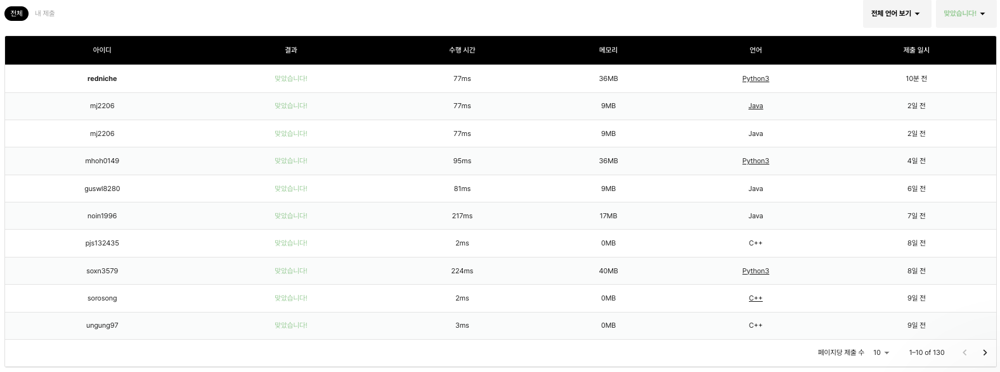

# 문제 링크

# 문제 풀이

1. 구현 문제이므로 문제에 제시된 내용을 잘 구현하면 됩니다.
2. 움직이는 것은 4방 탐색의 방식을 이용해 풀이합니다.
3. 이동거리를 1씩 올리고 출구를 만나면 해당 플레이어는 탈출합니다.
4. 움직일 때 전체 플레이어 중 최소값으로 출구와 플레이어 사이의 행거리 열거리 중 큰 값을 정사각형의 크기로 정합니다.
5. 회전할 사각형의 왼쪽 위 꼭짓점의 위치를 구합니다.
6. 모든 행, 열 원소를 탐색하며 사각형 범위 안에 출구와 플레이어가 있는지 확인하면 됩니다.
7. 사각형이 구해졌다면 회전을 시작합니다.
8. 미로는 행과 열을 전치행렬로 만들고 행(열의 나열 순서)을 뒤집으면 90도로 회전과 같습니다.
9. 마찬가지로 상대 좌표를 이용해 탈출구와 플레이어의 위치도 행과 열을 전치하고 열의 나열 순서를 뒤집습니다.
10. 2~9 과정을 시간이 다 되거나 플레이어가 없어질 때까지 반복합니다.

# 풀이 코드

```python
import sys
# sys.stdin = open('simulation/230607_ct_g3_메이즈 러너/1.in', 'r')
input = sys.stdin.readline

def solution(N, M, K, board, players, exit):
    drc = [(-1, 0), (1, 0), (0, -1), (0, 1)]
    answer = 0
    minsize = float('inf')
    def log(text):
        return
        print(text,"/////////////////////////")
        for i in board:
            print(i)
        print(players, 'players')
        print(minsize, 'minsize')
        print(exit, 'exit')
        print(answer, 'answer')
        print("/////////////////////////")
        print()


    def distance(r1, c1, r2, c2):
        return abs(r1-r2)+abs(c1-c2)

    def rectsize(r1, c1, r2, c2):
        return max(abs(r1-r2), abs(c1-c2))

    # 1. 이동과 확인
    def movecheck():
        nonlocal M, players, minsize, answer
        er, ec = exit
        nplayers, minsize = [], float('inf')
        for r, c in players:
            for dr, dc in drc:
                nr, nc = r + dr, c + dc
                if not (1 <= nr < N and 1 <= nc < N and board[nr][nc] <= 0):
                    continue
                if distance(r, c, er, ec) < distance(nr, nc, er, ec):
                    continue
                answer += 1
                if (nr, nc) != (er, ec):
                    nplayers.append([nr, nc])
                    minsize = min(rectsize(nr,nc,er,ec), minsize)
                break
            else:
                nplayers.append([r, c])
                minsize = min(rectsize(r,c,er,ec), minsize)

        players = nplayers
        return

    # 2. 사각형 위치, 크기 구하기
    def getrect():
        mw = minsize
        er, ec = exit
        for r in range(1, N):
            for c in range(1, N):
                # 정사각형의 좌상단 좌표가 (r, c)고 길이가 mw라면
                # er, ec의 좌표와, mr, mc가 정사각형 내부에 있는지 확인
                if r + mw > N or c + mw > N:
                    continue
                if not (r <= er <= r + mw and c <= ec <= c + mw):
                    continue
                for mr, mc in players:
                    if r <= mr <= r + mw and c <= mc <= c + mw:
                        return r, c, mw

    # 3. 90도 회전
    def rotation(r, c, w):
        nonlocal exit
        # 행과 열을 치환, 시계방향 90도
        t_board = [[board[i][j] for i in range(r+w, r-1, -1)] for j in range(c, c+w+1)]
        for i in range(r, r+w+1):
            for j in range(c, c+w+1):
                board[i][j] = t_board[i-r][j-c] - 1
        for i in range(len(players)):
            pr, pc = players[i]
            if r <= pr <= r+w and c <= pc <= c+w:
                rr, rc = pr - r, pc - c
                # pr, pc를 시계방향 90도 회전
                players[i] = [r + rc, c + w - rr]

        exit = [r + (exit[1] - c) , c + w - (exit[0] - r)]

    # 로직 수행
    for _ in range(K):
        movecheck()
        log('movecheck')
        if not players:
            break
        r, c, w = getrect()
        rotation(r, c, w)
        log('rotation')
    # 결과
    print(answer)
    print(*exit)

# 입력
N, M, K = map(int, input().split())
board = [['']*(N+1)]+[[''] + list(map(int, input().split())) for _ in range(N)]
players = [list(map(int, input().split())) for _ in range(M)]
exit = list(map(int, input().split()))
players = [[r, c] for r, c in players if not (r == exit[0] and c == exit[1])]

solution(N+1, M, K, board, players, exit)
```


